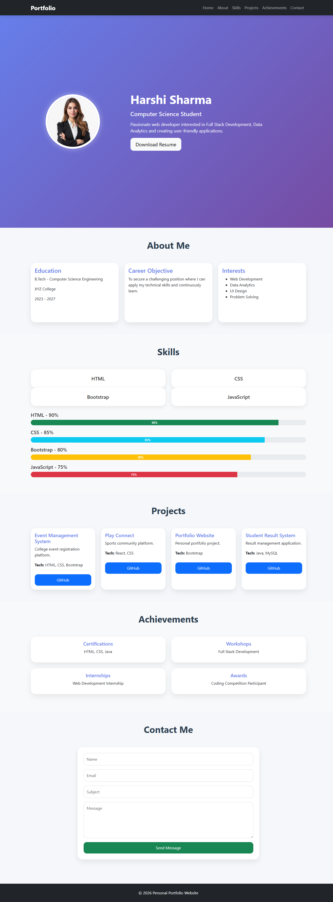

#  Personal Portfolio Website

## Project Overview

The Personal Portfolio Website is a responsive web application developed using HTML, CSS, Bootstrap, and JavaScript. The website showcases personal information, technical skills, projects, achievements, and contact details in a professional and visually appealing manner.

This portfolio serves as an online profile that can be used to present educational background, technical expertise, project experience, and accomplishments to recruiters, faculty members, and professionals.

---

##  Objectives

- Showcase personal profile and career goals.
- Display technical skills with proficiency levels.
- Present academic and personal projects.
- Highlight certifications, internships, workshops, and awards.
- Provide contact information through a responsive contact form.

---

##  Section 1: Home

### Features

- Profile Photo
- Name
- Designation
- Short Introduction
- Resume Download Button
- Responsive Hero Section

### Displayed Information

- Name: Harshi Sharma
- Designation: Computer Science Student
- Introduction:
  > Passionate web developer interested in Full Stack Development, Data Analytics, and creating user-friendly applications.

---

##  Section 2: About Me

### Educational Details

- B.Tech in Computer Science Engineering
- XYZ College
- 2023 – 2027

### Career Objective

To secure a challenging position where I can apply my technical skills, enhance my knowledge, and contribute effectively to organizational growth while continuously learning new technologies.

### Personal Interests

- Web Development
- Data Analytics
- UI Design
- Problem Solving

---

##  Section 3: Skills

Technical skills are displayed using Bootstrap Progress Bars and Skill Cards.

| Skill | Proficiency |
|---------|------------|
| HTML | 90% |
| CSS | 85% |
| Bootstrap | 80% |
| JavaScript | 75% |

### Bootstrap Components Used

- Cards
- Progress Bars
- Grid System

---

##  Section 4: Projects

### 1. Event Management System

**Description:**
A responsive platform for managing college event registrations and schedules.

**Technologies Used:**

- HTML
- CSS
- Bootstrap

---

### 2. Play Connect

**Description:**
A sports community platform where users can discover teammates and join sports activities.

**Technologies Used:**

- React
- CSS
- JavaScript

---

### 3. Portfolio Website

**Description:**
A personal portfolio website showcasing profile, projects, skills, and achievements.

**Technologies Used:**

- HTML
- CSS
- Bootstrap

---

### 4. Student Result Management System

**Description:**
A web-based system for managing and viewing student academic records.

**Technologies Used:**

- Java
- MySQL

---

##  Section 5: Achievements

### Certifications

- HTML Certification
- CSS Certification
- Java Certification

### Workshops

- Full Stack Development Workshop

### Internships

- Web Development Internship

### Awards

- Coding Competition Participant

---

##  Section 6: Contact

### Contact Form Fields

- Name
- Email
- Subject
- Message

### Additional Information

- Email Address
- Phone Number
- GitHub Profile
- LinkedIn Profile

---

##  Technologies Used

- HTML5
- CSS3
- Bootstrap 5
- JavaScript

---

##  Bootstrap Components Implemented

- Navbar
- Cards
- Progress Bars
- Forms
- Buttons
- Modal
- Grid System

---

## Responsive Features

- Mobile Friendly Design
- Tablet Compatibility
- Desktop Compatibility
- Responsive Bootstrap Grid Layout
- Adaptive Navigation Bar

---

## 📂 Project Structure

```text
Portfolio/
│
├── index.html
├── README.md
├── prop.jpg
└── assets/
```

---

##  Screenshots



---

##  GitHub Repository

Repository Name:

```text
Portfolio
```

Repository Link:

```text
ttps://github.com/Sri-2006-coder/Portfolio.git
```


---

## Project Outcome

The Personal Portfolio Website successfully demonstrates the implementation of Bootstrap components, responsive web design principles, and modern UI development techniques. It provides a professional platform to showcase personal and technical achievements while ensuring accessibility across multiple devices.
